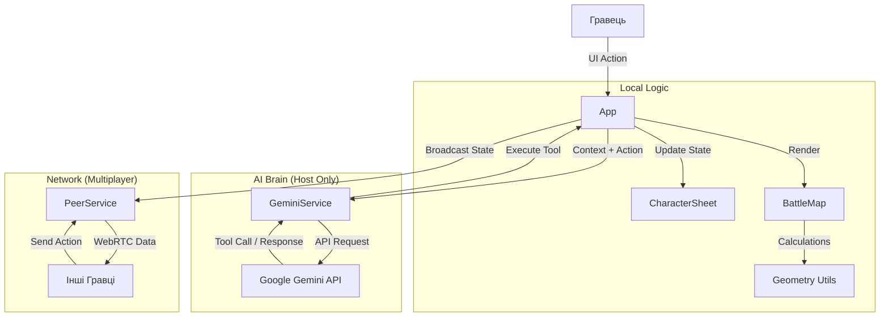
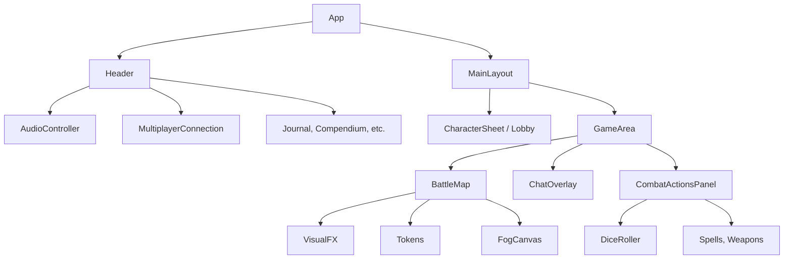

# Модульна Структура Додатку

Цей документ деталізує архітектуру проекту **AI Dungeon Master**, розбиваючи її на логічні модулі. Додаток побудований за принципом **Feature-based** модульності, де кожен модуль відповідає за конкретну ігрову механіку.

---

## 1. Core Module (Ядро)
**Відповідальність:** Ініціалізація, маршрутизація станів гри та глобальний менеджмент стану.

*   **`App.tsx`**: Головний контролер.
    *   Керує фазами гри: `Setup` -> `Lobby` -> `Game`.
    *   Тримає "єдине джерело правди" (State of Truth) для локальної гри.
    *   Обробляє вхідні події від AI та Мережі.
*   **`main.tsx` / `index.html`**: Точка входу, підключення провайдерів контексту (`ThemeProvider`, `AudioProvider`).
*   **`types.ts`**: Глобальні інтерфейси TypeScript, що використовуються всіма модулями.

---

## 2. AI Engine Module (Інтелект)
**Відповідальність:** Комунікація з Google Gemini API, обробка природної мови та генерація контенту.

*   **`services/geminiService.ts`**:
    *   **Chat Session:** Підтримує контекст розмови.
    *   **Tool Definitions:** Визначає JSON-схеми функцій (`update_hp`, `move_token`), які може викликати ШІ.
    *   **Request Queue:** Черга запитів для запобігання помилкам `429 Too Many Requests`.
    *   **Generators:** Функції для генерації картинок (`imagen`), NPC та описів.
*   **`components/DMTools.tsx`**: UI-інтерфейс для Майстра для виклику генераторів (NPC, Лут, Сюжет).

---

## 3. Networking Module (Мультиплеєр)
**Відповідальність:** Синхронізація стану гри між гравцями без сервера (P2P).

*   **`services/peerService.ts`**:
    *   Обгортка над **PeerJS**.
    *   **Host Logic:** Приймає з'єднання, розсилає `STATE_SYNC`.
    *   **Client Logic:** Відправляє дії (`CHAT`, `MOVE`) Хосту.
    *   **Heartbeat:** Механізм підтримки з'єднання (Ping/Pong).
*   **`components/MultiplayerConnection.tsx`**: UI відображення статусу мережі та коду кімнати.
*   **`components/LobbyPanel.tsx`**: Керування готовністю гравців та налаштуваннями сесії.

---

## 4. VTT Module (Віртуальний Стіл)
**Відповідальність:** Візуалізація тактичної карти, токенів та ефектів.

*   **`components/BattleMap.tsx`**: Головний компонент карти.
    *   Використовує **HTML Canvas** для шарів: Туман війни, Сітка, Ефекти.
    *   Використовує **DOM Elements** для інтерактивних об'єктів (Токени, Двері).
*   **`utils/geometry.ts`**: Математичне ядро для розрахунку видимості (Raycasting Algorithm) та ліній зору (Line of Sight).
*   **`utils/particleSystem.ts`** & **`components/VisualFX.tsx`**: Система частинок для візуалізації магії (вибухи, лікування) та погоди (дощ, сніг).
*   **`components/CombatTracker.tsx`**: UI списку ініціативи та станів (Conditions).

---

## 5. Character Module (Персонаж)
**Відповідальність:** Керування даними гравця, механікою D&D та інвентарем.

*   **`components/CharacterSheet.tsx`**:
    *   Інтерфейс листа персонажа.
    *   Логіка редагування статів, вибору класу/раси.
    *   Мультикласова логіка.
*   **`utils/mechanics.ts`**: Чисті функції розрахунку правил D&D (AC, Modifiers, Move Cost).
*   **`components/CombatActionsPanel.tsx`**: Інтерфейс дій у бою (Атака, Закляття, Ривок).

---

## 6. Persistence & Data Module (Дані)
**Відповідальність:** Збереження прогресу та зовнішні бази знань.

*   **`services/googleDriveService.ts`**: Інтеграція з Google Drive API для хмарних збережень.
*   **`services/dndApiService.ts`**: Клієнт до зовнішнього API (D&D 5e SRD) для отримання описів заклять та монстрів.
*   **`data/spells.ts`**: Локальна база даних найпопулярніших заклять для швидкого доступу.
*   **`components/CloudSaves.tsx`**: UI менеджер збережень (Локальні + Хмарні).

---

## 7. Audio Module (Звук)
**Відповідальність:** Створення атмосфери.

*   **`contexts/AudioContext.tsx`**: Глобальний стан аудіо (гучність, треки).
*   **`utils/audioSynth.ts`**: Генератор звукових ефектів (Web Audio API Oscillators) — кубики, кліки, успіх/невдача.
*   **`components/AudioController.tsx`**: UI мікшер гучності та амбієнту.

---

## Діаграма Потоку Даних (Data Flow)

## Діаграма Компонентів (Component Hierarchy)

